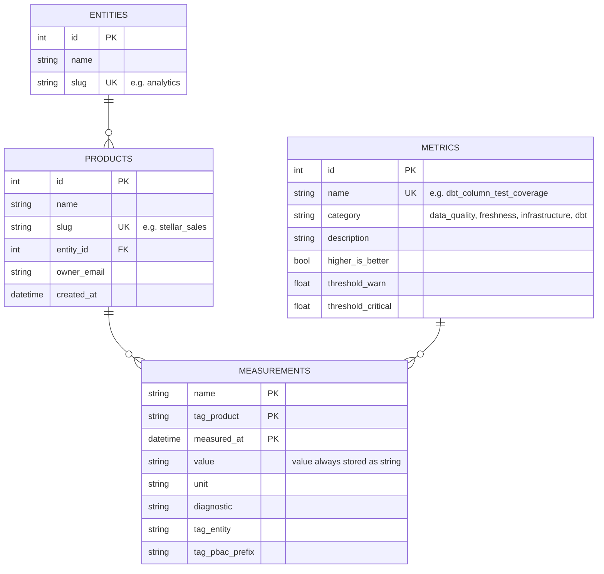

[](https://codespaces.new/datamindedacademy/skill-boost-exposing-apis)

# Skill Boost: Building & Exposing Data APIs

Learn to build data APIs that are secure and well-documented.

## Usecase

You're building an API for [**CheckUp**](https://github.com/datamindedbe/checkup) measurements, a tool for measuring data product health. The API exposes metrics like test coverage, documentation completeness, and staleness indicators.

By the end of these exercises, you'll have an API that can be securely used by an AI agent to answer questions like:
- *"Which products in marketing have failing test coverage?"*
- *"Show me the three worst-maintained products right now."*
- *"What's the trend for stellar_sales' test coverage over the last few weeks?"*

## Data Model

The `measurements` table is the fact table as generated by CheckUp.
Besides there are a couple dim tables: `products`, `entities`, `metrics`.



The full DDL + seed data is in [`data/seed.sql`](data/seed.sql).

## Getting Started

### GitHub Codespaces

Click the badge above.

### Local

Clone the repo:

```bash
git clone https://github.com/datamindedacademy/skill-boost-exposing-apis
cd skill-boost-exposing-apis
```

Start Postgres + Keycloak:

```bash
make up
```

Install dependencies:

```bash
make install
```

Run the API:

```bash
make api
```

## Exercises

The following exercises take an existing API and turn it into a RESTful, agent-ready one.

| # | Exercise                         | Focus                                   |
| - | -------------------------------- | --------------------------------------- |
| 1 | [Design](exercises/01_design/)   | REST API design                         |
| 2 | [ORM](exercises/02_orm/)         | SQLAlchemy ORM                          |
| 3 | [OpenAPI](exercises/03_openapi/) | Spec quality drives consumer ergonomics |
| 4 | [Auth](exercises/04_auth/)       | Scoped read access via OAuth scopes     |
| 5 | [Agent](exercises/05_agent/)     | Hand the API to an agent                |

## Running Tests & Solutions

Tests are the feedback mechanism for the exercises. The Makefile has targets for running the tests and for skipping ahead by applying a solution.

```bash
make test           # run all tests
make test-1         # tests for Exercise 1 only
make solve-2        # apply Ex 1 + 2 solutions
make reset          # back to clean starting state
```

## Services

Once `docker compose up -d` and `make api` are running, these are the services you'll interact with:

| Service        | URL                                | Credentials       |
| -------------- | ---------------------------------- | ----------------- |
| FastAPI        | http://localhost:8000              | -                 |
| Swagger UI     | http://localhost:8000/docs         | -                 |
| OpenAPI Spec   | http://localhost:8000/openapi.json | -                 |
| Keycloak Admin | http://localhost:8080              | admin / admin     |
| Postgres       | localhost:5432                     | checkup / checkup |

## Getting Tokens

Two Keycloak users back the auth exercise: one with wildcard product access, one scoped to `stellar_sales`. Either of these will do for testing your API.

- **Token with full access**

```bash
export CHECKUP_API_TOKEN=$(make token-all)
```

- **Token with limited access**

```bash
export CHECKUP_API_TOKEN=$(make token-stellar)
```

## Using with an AI Agent

Once you've completed the exercises, try the API with Claude Code:

1. Make sure the API is running (`make api`)
2. Set the `CHECKUP_API_TOKEN` environment variable (see [Getting Tokens](#getting-tokens))
3. Open Claude Code and prompt away!

The agent will use the skills in `.claude/skills/`.
